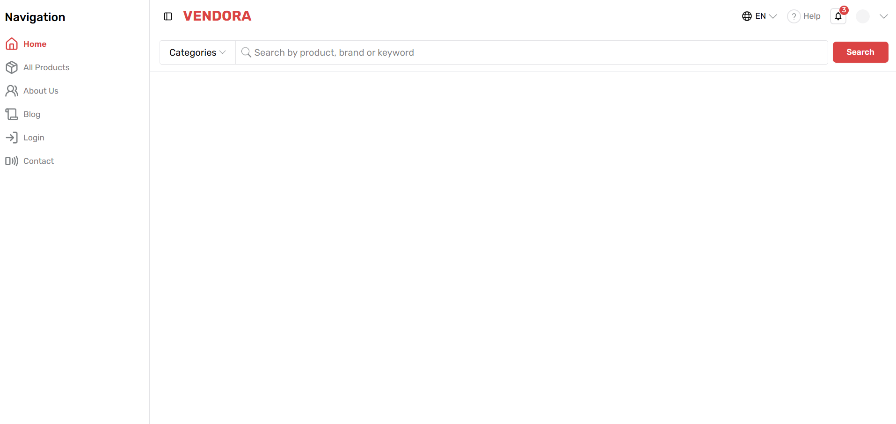
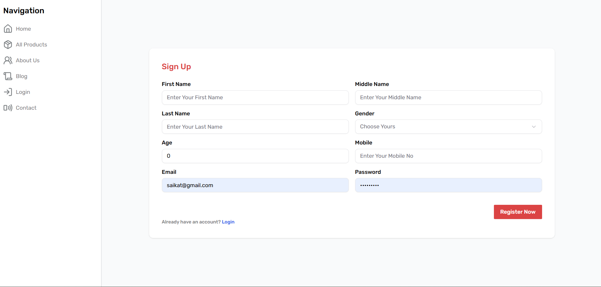
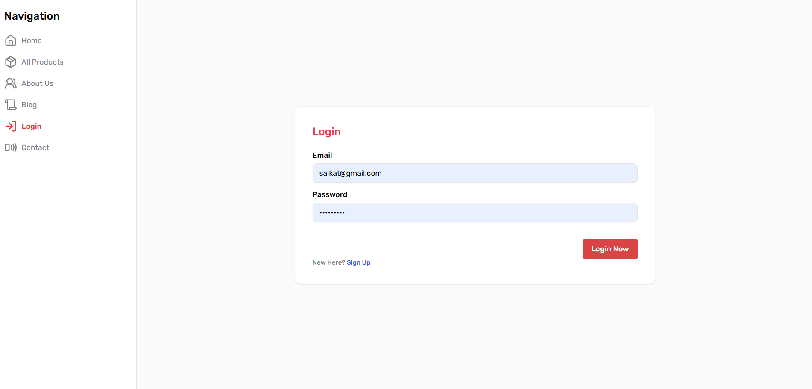
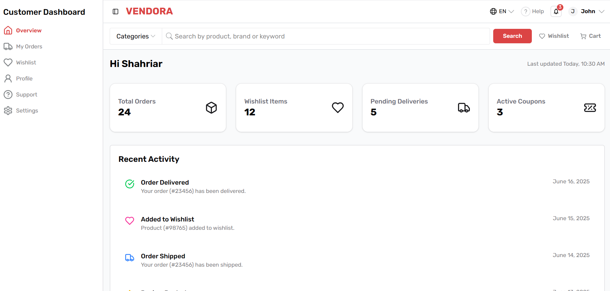
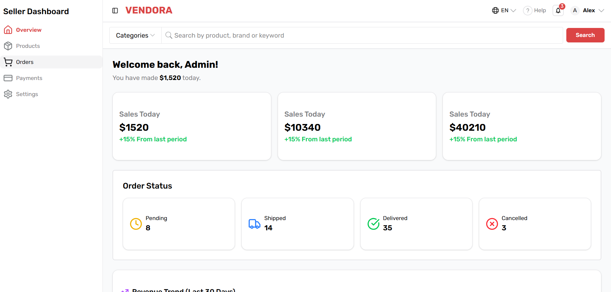

# 🛍️ Vendora | A Multi-Vendor E-Commerce Application

Vendora is a full-stack multi-vendor e-commerce application built with the MERN stack. It’s a feature-rich platform where multiple vendors can register and sell their own products. The application currently supports three main user roles:

- 🛠️ **Admin** (Upcoming Feature)
- 🛒 **Seller**
- 👤 **Customer**

Unauthenticated users can also browse certain public routes as guests.

> ⚠️ **Note:** This project is still under development. Many major features are currently in progress and will be fully functional very soon.

# 🧪 Demo Credentials

You can use the following demo accounts to explore the application:

| Role     | Email                | Password    |
| -------- | -------------------- | ----------- |
| Seller   | alexarnold@gmail.com | seller123   |
| Customer | johnmount@gmail.com  | customer123 |

> ⚠️ Note: These are test accounts with limited permissions. Please don’t modify sensitive data.

# ✨ Key Features

### 👥 User Roles

- 🔓 **Public:** Browse products, view categories
- 👤 **Customer:** Add to cart, checkout, view orders
- 🛒 **Seller:** Manage products, view orders, update listings
- 🛠️ **Admin:** (Upcoming) Review and approve products, manage users and vendors

### 🧩 Core Features

- 🔐 **Authentication** using JWT with role-based access control ✅
- 🛍️ **Product Management** for sellers ⌛
- 💳 **Cart & Checkout** system for customers ⌛
- ⚙️ **Admin Product Review** system ⌛
- 🗃️ **Category & Tag Filtering** ⌛
- 📦 **Order History** for both customers and sellers ⌛
- 🧩 **Reusable Form Components** (custom `FormWrapper` and `InputField`) ✅
- 🖼️ **Product Image Uploading** functionality ⌛
- 🛡️ **Protected Routes** based on user roles ✅
- 🚫 **Custom 404 Not Found Page** ✅

# 🚀 Live Demo

- 🔗 **Live Site:** [https://vendora-e-commerce.netlify.app](https://vendora-e-commerce.netlify.app)
- 🌐 **Live API (Backend):** [https://vendora-server.onrender.com](https://vendora-server.onrender.com)

---

### 📂 GitHub Repositories

- 💻 **Frontend:** [GitHub - Vendora Client](https://github.com/Shahriar090/Vendora-Client)
- 🛠️ **Backend:** [GitHub - Vendora Server](https://github.com/Shahriar090/vendora-server)

# 🖼️ Screenshots

**Home Page**


**Register Page/ Sign Up**


**Login Page**


**Customer Dashboard**


**Seller Dashboard**


### NOTE: Admin Dashboard currently unavailable. But it will be available soon as so many features are under development

# 🛠️ Tech Stack

- ⚛️ **React.js** – JavaScript library for building interactive UIs
- 🧩 **TypeScript** – Superset of JavaScript for static type checking
- 🧭 **React Router DOM** – For client-side routing and navigation
- 🎨 **Tailwind CSS** – Utility-first CSS framework for styling
- 🧱 **ShadCN UI** – Pre-built accessible components styled with Tailwind
- 📝 **React Hook Form** – Performant and flexible form handling library
- 📤 **React Dropzone** – Drag-and-drop file upload UI component
- 🌐 **Netlify** – Hosting platform for deploying the frontend

# 🚀 Getting Started

Follow these steps to set up the project locally:

### 🔃 Clone & Install (Frontend)

```bash
# Clone the repository
git clone https://github.com/Shahriar090/Vendora-Client.git

# Navigate into the project folder
cd vendora-client

# Install dependencies
npm install

# Start the development server
npm run dev
```

# 📂 Folder Structure

This is a high-level overview of the `vendora-client` directory structure:

Vendora Client (Root folder)

- dist => (Production ready optimized version)
- public => (Static files)
- src => (Application's root folder)
- Api => (Axios interceptor)
- assets => (Static icons/images/svg's)
- Components => (Re-usable components)
- Contexts => (All contexts of React Context api hook)
- Hooks => (Re-usable custom logic/hooks)
- Icons => (Re-usable custom svg icons as component)
- Layouts => (Different application layouts )
- lib => ()
- Pages => (Different pages of the application)
- Customer => (Separated customer layout related pages under pages folder)
- Public => (Separated public layout related pages under pages folder)
- Seller => (Separated customer layout related pages under pages folder)
- Providers => (Providers of context api)
- Routes => (Application routes of different layouts)
- types => (Typescript types)
- Utils => (Utility functions)
- App.tsx => (Representing application routes)
- index.css => (Root css file)
- main.tsx => (entry point of the application)

# 🔐 Authentication & Role Protection

- Role-based route protection using PrivateRoute and RoleGuard.

- Tokens stored securely (HTTP-only cookie).

- Redirects unauthorized users to login or appropriate error page.

# 📦 Deployment

- Netlify => Front End Hosting
- Render => Back-End + API
- MongoDB Atlas => Database

# 🧑‍💻 Author

### Mohammad Shahriar Hossain

#### MERN Stack Developer

#### 📧shahriarh655@gmail.com

#### 🌐 Portfolio | LinkedIn | GitHub

- 🔗 [Portfolio](https://dev-shahriar.netlify.app/)
- 🔗 [LinkedIn](https://www.linkedin.com/in/shahriarhsn/)
- 🔗 [GitHub](https://github.com/Shahriar090)

## 🙏 Acknowledgements

I am truly grateful to **FourBTech** for shortlisting me and giving me the opportunity to prove myself. I understand that there’s still work needed to make this application fully complete, but I’m confident in my ability to implement all the remaining features — it’s only a matter of time.

Due to some personal and family matters, I couldn’t give 100% within the deadline. I know that in professional settings, missing a deadline is rarely excusable, and I take full responsibility for that.

That said, as mentioned in the task description — _"This is not just a coding assignment — it is a test of your problem-solving, decision-making, and communication skills under real-world development constraints."_ — I have tried my best to demonstrate all of these qualities through my work and approach.

In one of my earlier e-commerce projects, **[Gearly Server](https://github.com/Shahriar090/Gearly-Server)**, I successfully implemented features such as:

- Product listing by admin
- Add to cart & checkout functionality
- Payment integration using SSLCommerz

While I couldn't integrate all these features into this evaluation task due to time constraints, I genuinely enjoyed working on it and appreciated the learning experience.

Thank you once again for the opportunity. I look forward to any feedback you may have and would be honored to contribute to this project or other exciting opportunities in the future.
